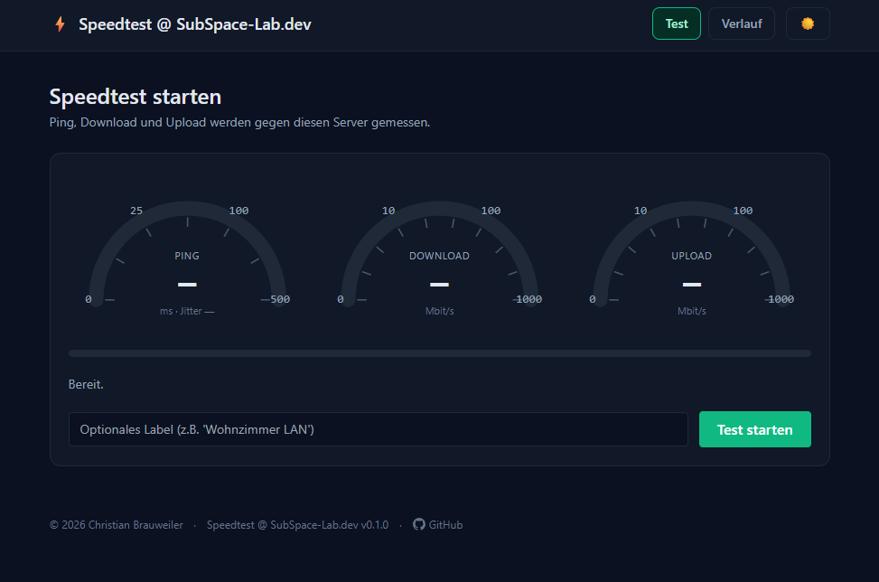

# Speedtest

Selbst gehosteter Speedtest in **PHP + Tailwind + SQLite**.
Misst Ping/Jitter, Download und Upload gegen den eigenen Server, speichert jedes
Ergebnis unter einem teilbaren UUID-Link und kommt ohne Composer-, Node- oder
Datenbank-Server-Abhängigkeit aus.



## Features

- **Halbkreis-Gauges im Ookla-Stil** mit log-fester Skala (0…1000 Mbit/s),
  Live-animiert während des Tests.
- **Ping/Jitter** über getrimmtes Mittel aus 12 Samples.
- **Parallele Streams** für Down- und Upload, fest definierte Mess­fenster.
- **Hell-/Dunkel-Theme** via CSS-Variablen, speichert die Wahl in `localStorage`.
- **Verlauf**: konfigurierbare Anzahl letzter Tests, optional mit Label.
- **Geteilte Ergebnis-URLs** (`/r/<uuid>`).
- **IP-Anonymisierung** per gesalzenem SHA-256-Hash.
- **Zero-Deps**: nur PHP-Standardlib, SQLite-Datei wird beim ersten Start erzeugt.

## Voraussetzungen

- PHP **8.1+** mit `pdo_sqlite`
- Web-Server mit Rewrite-Unterstützung (Apache mit `mod_rewrite`, Nginx, Caddy, Synology Web Station …)
- Schreibrechte für `data/` und – wenn der Seed genutzt wird – `blob/`

Browser-seitig wird ein moderner Browser mit `fetch` + Streams vorausgesetzt
(Chrome/Edge/Firefox/Safari der letzten Jahre).

## Installation

```bash
git clone https://github.com/cbrauweiler/Speedtest.git speedtest
cd speedtest
cp config.example.php config.php
# config.php anpassen — mindestens ip_hash_salt setzen
```

`config.php` ist gitignored und wird pro Deployment einzeln gepflegt.
`config.example.php` ist das mitgelieferte Template mit allen verfügbaren
Schlüsseln und ihren Defaults.

Anschließend den Ordner unter dem Web-Server erreichbar machen:

- **Apache**: einfach im DocumentRoot ablegen, `.htaccess` ist beigelegt.
- **Synology Web Station**: virtuellen Host auf den Ordner zeigen lassen,
  PHP-Profil mit `pdo_sqlite` wählen.
- **Nginx**: alle Requests an `index.php` weiterleiten und `lib/`, `views/`,
  `data/`, `bin/` blocken (siehe `.htaccess` als Vorlage).

Beim ersten Aufruf legt PHP die SQLite-Datei `data/speedtest.sqlite` an.

### Optional: Static Blobs für >1 Gbit/s

Bei sehr schnellen Anschlüssen kann der PHP-Streaming-Pfad zum Bottleneck
werden. Dann einmalig

```bash
php bin/seed.php
```

ausführen — das erzeugt vorab Random-Files unter `blob/`, die Apache direkt
ausliefern kann.

## Konfiguration

Alle einstellbaren Schlüssel stehen in `config.example.php`. Nach dem Kopieren
nach `config.php` werden sie wirksam:

| Schlüssel | Default | Bedeutung |
|---|---|---|
| `app_name` | `Speedtest` | Anzeigename in Header und Footer |
| `app_version` | `0.1.0` | Versionsnummer im Footer |
| `repo_url` | `''` | Link zum Quellcode (Footer-Button, leer = ausgeblendet) |
| `db_path` | `data/speedtest.sqlite` | Pfad zur SQLite-Datei (Auto-erzeugt) |
| `blob_dir` | `blob/` | Verzeichnis für optionale Static-Blobs |
| `allowed_sizes` | `[2, 5, 10, 25, 50, 100]` | erlaubte Download-Größen in MB (Whitelist) |
| `history_limit` | `100` | Anzahl Einträge unter `/history` |
| `ip_hash_salt` | `CHANGE-ME-…` | Salt für Client-IP-Hash — **unbedingt überschreiben** |
| `base_path` | `''` | URL-Präfix, falls App nicht im Root liegt (z.B. `/tools/speedtest`) |

## Optische Anpassung

Alle Farben liegen als CSS-Variablen in [`assets/theme.css`](assets/theme.css),
getrennt nach Light (`:root`) und Dark (`:root[data-theme="dark"]`):

| Variable | Zweck |
|---|---|
| `--bg`, `--surface`, `--surface-2` | Hintergrund-Stufen |
| `--ink`, `--ink-muted`, `--ink-subtle` | Textfarben |
| `--line` | Rahmen-/Trennlinien |
| `--accent`, `--accent-soft`, `--accent-ink` | Aktion / Button / Fortschrittsbalken |
| `--gauge-ping` | Farbe Ping-Gauge (Default: amber/gold) |
| `--gauge-down` | Farbe Download-Gauge (Default: hellblau/sky) |
| `--gauge-up` | Farbe Upload-Gauge (Default: violet) |
| `--danger`, `--danger-soft` | Warnung/Fehler |

Anpassen heißt: Werte in der CSS-Datei überschreiben — kein Build nötig,
Tailwind hängt direkt an diesen Variablen.

Der Theme-Toggle (☀ / ☾) sitzt im Header und merkt sich die Wahl. Default ist
der Systemwert (`prefers-color-scheme`).

### Gauges feinjustieren

Die Skala der Gauges sitzt in [`assets/speedtest.js`](assets/speedtest.js) als
`GAUGES`-Objekt. `stops` ist die Liste der Stützstellen — die Werte zwischen
zwei Stützstellen werden linear auf den Bogen abgebildet. Beispiel: wenn dein
Anschluss bis 2,5 Gbit/s geht, einfach `1000 → 2500` ergänzen.

```js
const GAUGES = {
    ping: { stops: [0, 10, 25, 50, 100, 200, 500], ... },
    down: { stops: [0, 1, 5, 10, 25, 50, 100, 250, 500, 1000, 2500], ... },
    up:   { stops: [0, 1, 5, 10, 25, 50, 100, 250, 500, 1000], ... },
};
```

Strichstärke der Gauges und Position der Beschriftungen sind ebenfalls dort
und in `theme.css` (`.gauge-arc`, `.gauge-track`, `.gauge-tick-label`)
konfigurierbar.

## Architektur

```
index.php             Front-Controller, leichtes Routing
config.php            Defaults
config.local.php      lokale Overrides (gitignored)
lib/
  db.php              PDO-SQLite + Auto-Migration
  routes.php          alle HTML- und JSON-API-Routes
  helpers.php         Render, UUID, Format-Helfer
views/
  layout.php          Header, Footer, Theme-Toggle
  index.php           Test-Seite mit Gauges
  history.php         Liste der letzten Ergebnisse
  result.php          einzelnes Ergebnis (UUID-Link)
assets/
  speedtest.js        Test-Runner + Gauge-Renderer
  theme.css           Theme-Variablen + Gauge-Styles
bin/
  seed.php            optional: Static-Blobs erzeugen
data/                 SQLite-Datei (gitignored)
blob/                 Static-Test-Files (gitignored)
```

## Sicherheit

- IPs werden nicht gespeichert, nur ein gesalzener SHA-256-Hash (16 Hex-Chars).
- `lib/`, `views/`, `data/`, `bin/` und `config.php` werden per `.htaccess`
  hart geblockt — vor dem Deploy auf Nicht-Apache-Servern unbedingt
  äquivalente Regeln einrichten.
- `ip_hash_salt` in `config.local.php` setzen — der Default-Wert ist ein
  Platzhalter.
